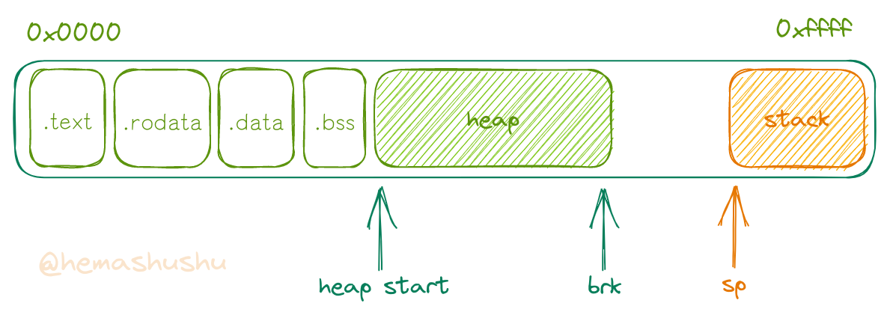
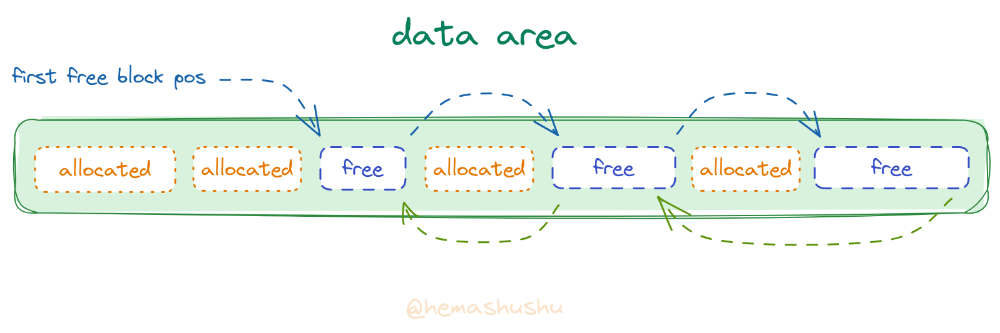
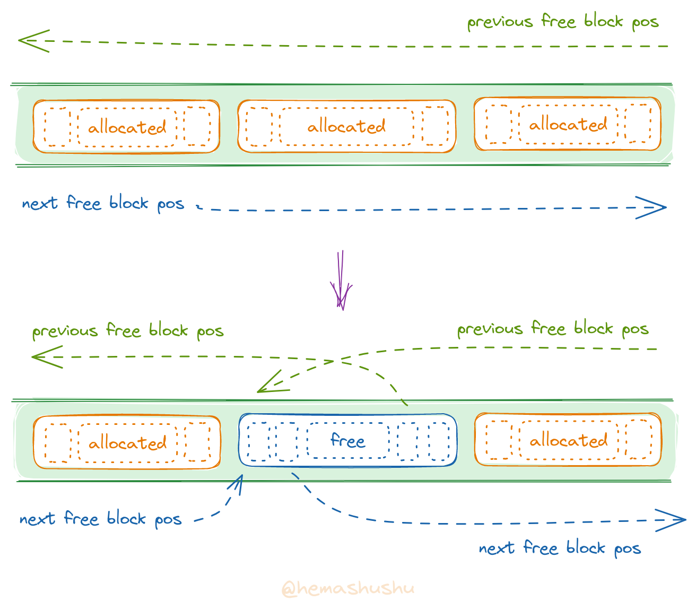
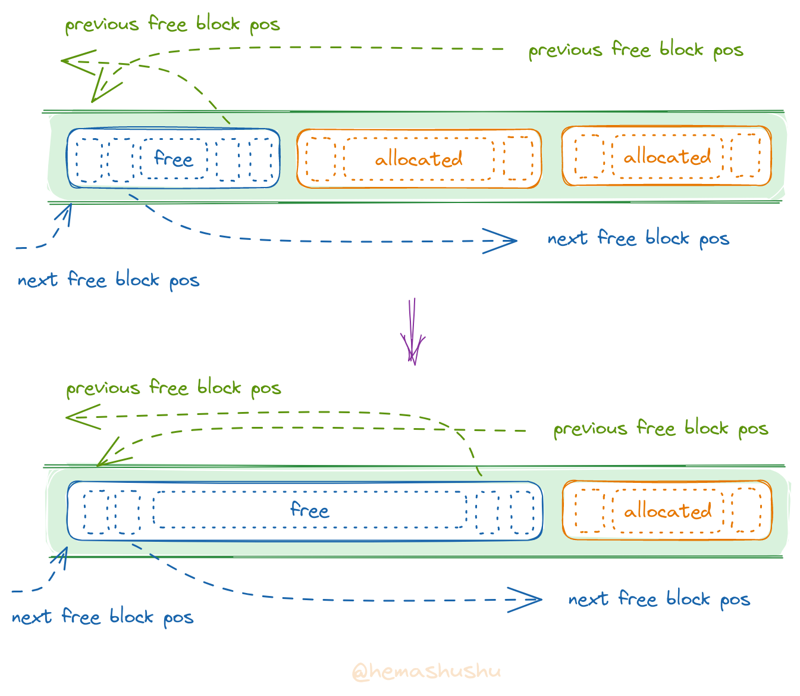
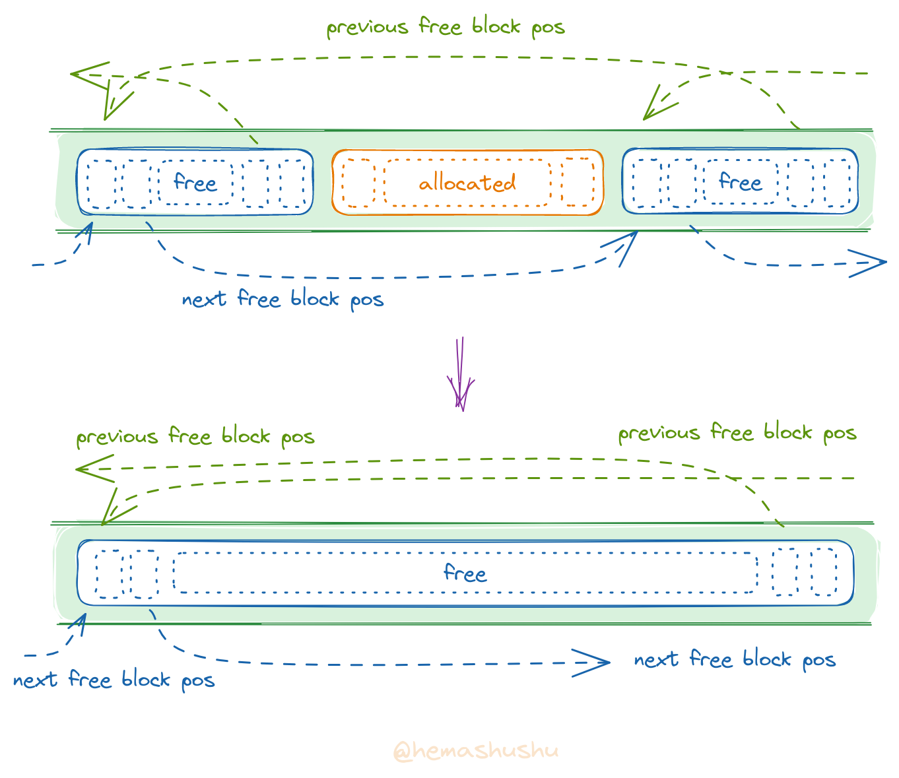
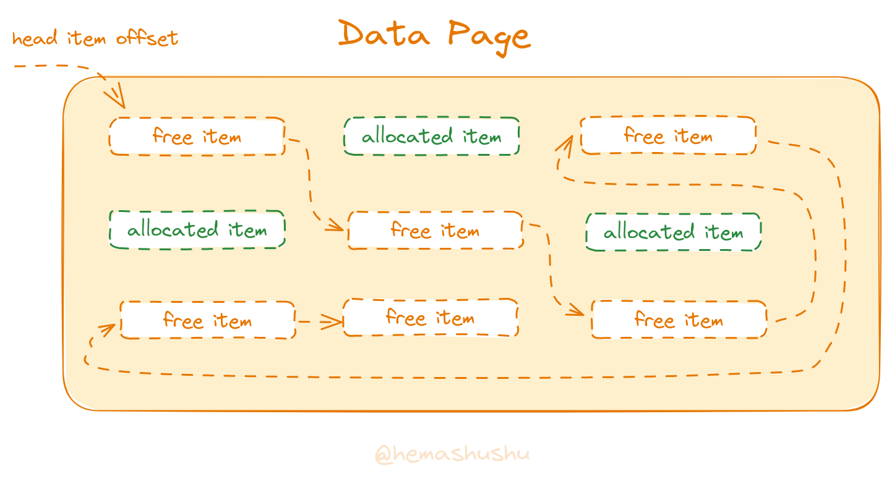
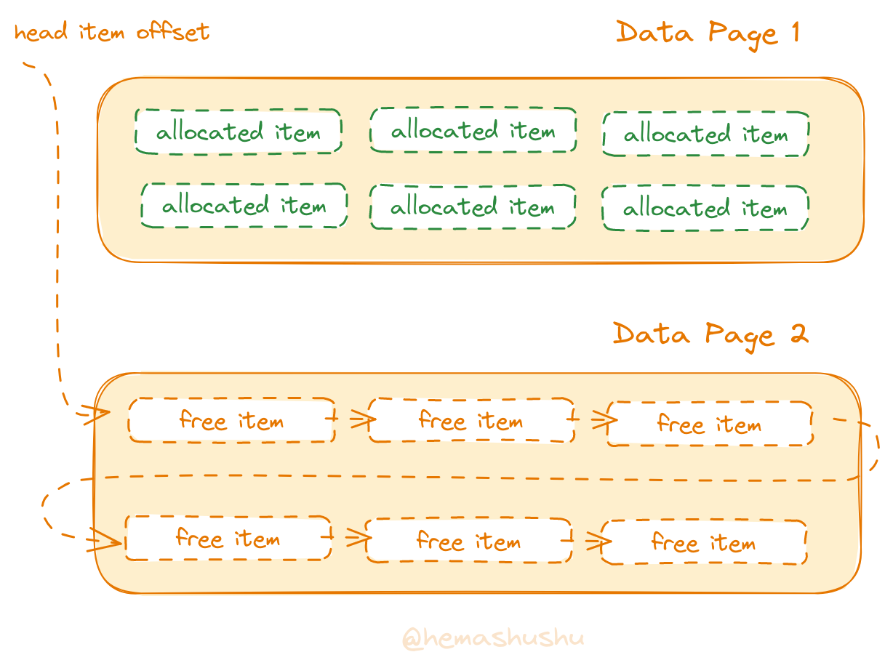
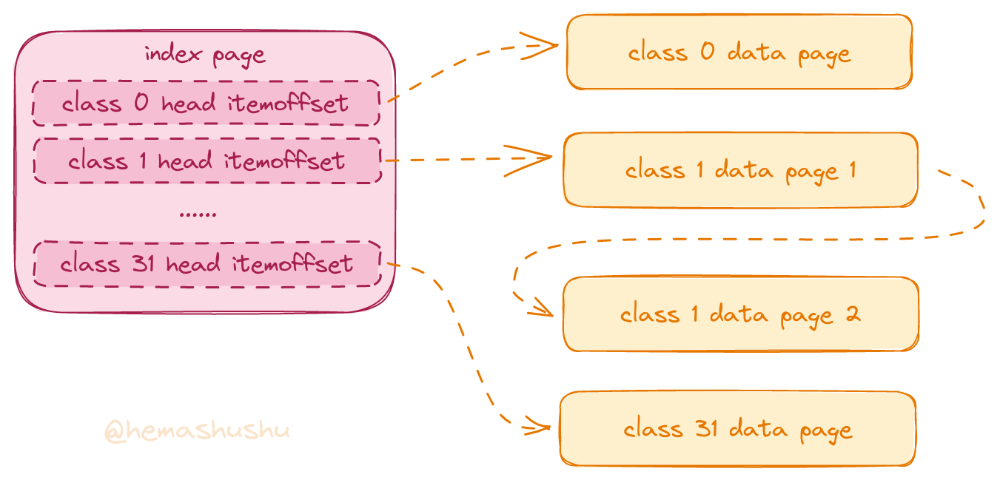

# XiaoYu Allocator

专为 32 位微控制器（MCU）和微处理器（MPU）而设计的高效 _heap_ 动态分配器。是 [XiaoYu OS](https://www.github.com/hemashushu/xiaoyu-os) 的核心组件之一。

特点：

- 为内存资源非常有限（最小支持 4KiB）的 MCU 而优化；
- 分配和释放内存的速度快；
- 有效降低内部碎片和外部碎片的产生。

_XiaoYu Allocator_ 默认支持 128 MiB 内存，可配置为 _大内存模式_，最大支持 4 GiB 内存。如果需要用在 64 位的环境，请使用另一个分配器 [XiaoXuan Allocator](https://www.github.com/hemashushu/xiaoxuan-allocator) 。

<!-- @import "[TOC]" {cmd="toc" depthFrom=2 depthTo=5 orderedList=false} -->

<!-- code_chunk_output -->

- [编译和测试](#-编译和测试)
- [API 接口](#-api-接口)
  - [init](#-init)
  - [alloc](#-alloc)
  - [free](#-free)
- [原理](#-原理)
  - [内存的结构](#-内存的结构)
  - [_Heap_ 的结构](#-_heap_-的结构)
    - [_Header_ 的结构](#-_header_-的结构)
    - [_Data area_ 的结构](#-_data-area_-的结构)
      - [_Free block_ 的结构](#-_free-block_-的结构)
      - [_Allocated block_ 的结构](#-_allocated-block_-的结构)
      - [标记位](#-标记位)
  - [_可变大小分配器_ 的工作过程](#-_可变大小分配器_-的工作过程)
    - [_Free block_ 的插入及合并](#-_free-block_-的插入及合并)
  - [固定大小内存分配器](#-固定大小内存分配器)
    - [_索引页_ 的结构](#-_索引页_-的结构)
    - [_数据页_ 的结构](#-_数据页_-的结构)
      - [_Free item_ 的结构](#-_free-item_-的结构)
      - [_Allocated item_ 的结构](#-_allocated-item_-的结构)
    - [_索引页_ 和 _数据页_ 示例](#-_索引页_-和-_数据页_-示例)
  - [_固定大小分配器_ 的工作过程](#-_固定大小分配器_-的工作过程)
    - [_数据页_ 的创建过程](#-_数据页_-的创建过程)
- [多核环境](#-多核环境)
- [License](#-license)

<!-- /code_chunk_output -->

## 编译和测试

TODO::

## API 接口

### init

`fn init(heap_pos: u32, brk: u32) -> Result<(), AllocatorErr>`

### alloc

`fn alloc(size: u32) -> Result<u32, AllocatorErr>`

### free

`fn free(addr: u32)`

TODO::

## 原理

分配器的作用是将内存中的一段连续区域（以下简称为 _内存片段_）的 _开始位置（即地址）_ 和 _长度_ 通过一定的方式记录下来，并将 _内存片段_ 的开始位置返回给请求者，请求者可以随时读写这个内存片段。在请求者尚未 **声明不再使用这个内存片段** 之前，分配器需要保证这个内存片段不会被其它程序占用、修改或者移动。

_XiaoYu Allocator_ 由 _可变大小分配器_ 以及 _固定大小分配器_ 两部分组成。其中 _可变大小分配器_ 使用一个 _显式的空闲块双向链表_ 实现，而 _固定大小分配器_ 使用一个 _索引页_ 和多个 _空闲项单向链表页_ 实现。

### 内存的结构

下图是一个典型的应用程序的内存视图：



分配器负责分配上图当中的 _heap_ 区域的内存，即从 `heap start` 到 `brk` 之间的区域。

### _Heap_ 的结构

_heap_ 由一个 _header_ 和一个 _数据区域_ 组成：

```text
| header | data area |
```

#### _Header_ 的结构

```text
| magic number | data area pos | index page pos | first free block pos | brk value |
```

- `magic number`：[u8; 8]，用于表示 _XiaoYu Allocator_ 的幻数，值为 HEX `78 79 61 6c 6c 6f 63 01`，对应字符串 `xyalloc`，最后一个字节 `0x01` 表示版本号。`magic number` 用于标识 _heap_ 是否已经初始化；
- `data area pos`：uint32，_data area_ 的开始地址；
- `index page pos`：uint32，_index page_ 的开始地址；
- `first free block pos`：uint32，第一个 _free block_ 的地址；
- `brk value`：uint32，`heap` 的结束位置。

#### _Data area_ 的结构

_Data area_ 由 _零个或多个已分配的内存片段_ 以及 _一个或多个未分配的内存片段_ 组成。

为了方便描述，根据不同的分配状态，以下使用不同的名称来称呼内存片段：

- 已分配的内存片段称为 _已分配块_ （_allocated block_）；
- 未分配的内存片段称为 _空闲块_ （_free block_）。

在分配器初始化之后，_data area_ 只存在一个 _free block_，这个 _free block_ 占据了整个 _data area_。

随着应用程序的运行和时间的推移，许多 _allocated block_ 将会被创建（从 _free block_ 分割或转换而得），同时也有许多 _allocated block_ 被释放，被释放的 _allocated block_ 会重新转换为 _free block_。这时 _data area_ 会存在着许多个被 _allocated block_ 间隔开来的 _free block_。

_可变大小分配器_ 会 **按照位置的顺序** 将所有 _free block_ 串联起来，形成一个**显式的有序双向链表**，称为 _free block linked list_。分配器使用该链表管理空闲的内存。

_free block linked list_ 是一个 _有序链表_，所有 _free block_ 按照从 `低端地址` 到 `高端地址` 的顺序排列并连接。当一个 _allocated block_ 被释放后，会根据它所在的位置插入到链表的相应位置。如果相邻的位置刚好也是 _free block_，则会跟它们合并。

下面的图演示了一个包含有 3 个 _allocated block_ 和 3 个 _free block_ 的 _data area_：



> _free block linked list_ 总会有一个 _free block_ 位于链表的末尾。

##### _Free block_ 的结构

```text
| block size | next block pos | free memory | previous block pos | block size |
```

- `previous block pos` 和 `next block pos`：uint32，分别是前一个和后一个 _free block_ 的位置。
- `block size`：uint32，是当前 _free block_ 的总长度（即 **包括** `block offset` 和 `block size` 等字段在内的长度）。

`previous block pos` 和 `next block pos` 的值在下列情况下其值为 0：

- 当 _free block_ 是链表的第一个 _free block_ 时，`previous block pos` 的值为 0；
- 当 _free block_ 是链表的最后一个 _free block_ 时，`next block pos` 的值为 0；
- 当整个链表只包含一个 _free block_ 时，它的 `previous block pos` 和 `next block pos` 的值都是 0。

##### _Allocated block_ 的结构

```text
| block size | data | block size |
```

注意：

- `data` 的长度必须是 4 的倍数。
- 分配内存时，分配器返回给应用程序的是 `data` 字段的开始位置（内存指针），当应用程序释放 _allocated block_ 时，（通过参数）传递给分配器的也是 `data` 字段的位置。但分配器管理内存片段时使用的是该片段的开始位置（即 `block size` 字段的位置）。

##### 标记位

分配器要求内存片段的大小必须是 4 的倍数（同时也是为了实现内存的 4 bytes 对齐），所以 `block size` 和 `block size` 数值的低 2 bits 的值总是 0。分配器将这 2 bits 用作为标记位，其中最低位是 `type` flag，第 2 低位是 `status` flag，如下图所示：

```text
|       [31:2]     | [1:1]  | [0:0] |
| block size value | status | type  |
```

这两个字段的数值及含义如下：

`status flag`

- 0：表示 _free block_；
- 1：表示 _allocated block_。

`type flag`

- 0：表示可变大小内存片段；
- 1：表示固定大小内存片段。

### _可变大小分配器_ 的工作过程

当分配器初始化之后，_free block linked list_ 只包含一个 _free block_，该 _free block_ 占据了整个 _data area_。

当应用程序请求分配一个 _可变大小_ 的内存片段：

1. _可变大小分配器_ 从链表的第一个 _free block_ 开始遍历，如果找到的 _free block_ 容量比请求的容量小，则继续往后找；

2. 当找到一个容量等于请求的大小的 _free block_ 时，_free block_ 会被转换为 _allocated block_；

3. 当找到一个容量大于请求的大小的 _free block_ 时，分配器会从 _free block_ 的左边（低地址端）分割一部分出来并成为一个 _allocated block_ ，而 _free block_ 会缩小至剩下的部分。

4. 当分配器遍历到最后一个 _free block_ 且容量不足以分配时，分配器会尝试增加 _heap_ 的空间，即向高地址端移动 `brk`。如果扩充成功，则最后一个 _free block_ 先会增大容量，然后再进行分割。如果扩充失败，则分配失败。

当应用程序释放 _allocated block_ 时：

1. 分配器会把该 _allocated block_ 转换为 _free block_，并根据 _allocated block_ 的位置插入到 _free block linked list_ 相应的位置（详细见下一节）；

2. 当新的 _free block_ 插入到 _free block linked list_ 且相邻的位置也是 _free block_ 时，则新的 _free block_ 将会跟相邻的 _free block_ 合并（详细见下一节）。

> 显然在链表里，不存在两个紧密相邻的 _free block_，因为它们会被合并。

#### _Free block_ 的插入及合并

当一个新 _free block_（即被释放的 _allocated block_）插入到 _free block linked list_ 时，会有以下这几种情况：

1. 前后均为 _allocated block_



这种情况不需要合并 _free block_，只需把 _allocated block_ 转换为 _free block_ 即可。具体需要更新的字段有：

- 位于当前 _allocated block_ 之前的第一个 _free block_ 的 `next block pos` 字段，更新它的值为当前 _allocated block_ 的位置。
  注：如果当前 _allocated block_ 的位置比 `first node pos` 小，则说明不存在位于它之前的 _free block_，这时需要更新 `first node pos` 字段，让它的值为当前 _allocated block_ 的位置。也就是说，当前 _allocated block_ 将会成为第一个 _free block_；
- 位于当前 _allocated block_ 之后的第一个 _free block_ 的 `previous block pos` 字段，更新它的值为当前 _allocated block_ 的位置；
- 当前 _allocated block_ 的 `status` flag 更新为 0；
- 当前 _allocated block_ 添加 `next block pos` 和 `previous block pos` 字段，分别指向下一个和前一个 _free block_ 的位置。注：如果当前 _allocated block_ 即将要成为链表的第一个 _free block_，则 `previous block pos` 的值应该为 0。

> 分配器采用遍历 _free block linked list_ 的方法来寻找当前 _allocated block_ 之前及之后的第一个 _free block_。即从第一个 _free block_ 开始遍历，找到第一个位置比当前 _allocated block_ 大的 _free block_，该 _free block_ 则为当前 _allocated block_ 的后一个 _free block_。读取该 _free block_ 的 `previous block pos`，则找到当前 _allocated block_ 的前一个 _free block_。

2. 前一个是 _free block_



这种情况需要合并前一个 _free block_。具体需要更新的有：

- 前一个 _free block_ 的第一个 `block size` 字段，更新它的值为它们两者的总长度；
- 当前 _allocated block_ 的第二个 `block size` 字段，更新它的值为它们两者的总长度；
- 当前 _allocated block_ 添加 `previous block pos` 字段，其值为前一个 _free block_ 的位置。

3. 后一个是 _free block_

这种情况跟 _情况2_ 类似，不同的是需要合并后一个 _free block_。具体需要更新的有：

- 后一个 _free block_ 的第二个 `block size` 字段，更新它的值为它们两者的总长度；
- 当前 _allocated block_ 的第一个 `block size` 字段，更新它的值为它们两者的总长度；
- 当前 _allocated block_ 添加 `next block pos` 字段，其值为前一个 _free block_ 的位置。

4. 前后都是 _free block_



这种情况需要合并前后两个 _free block_。具体需要更新的有：

- 前一个 _free block_ 的第一个 `block size` 字段，更新它的值为它们三者的总长度；
- 后一个 _free block_ 的第二个 `block size` 字段，更新它的值为它们三者的总长度。

### 固定大小内存分配器

_固定大小分配器_（_fixed size allocator_）是 _XiaoYu Allocator_ 的一个子系统，它运行于 _可变大小分配器_ 的基础之上。用于快速分配具有固定大小且容量较小（小于等于 128 bytes）的内存。

> 当程序请求分配或者释放一个容量大于 128 bytes 的内存片段时，则由 _可变大小分配器_ 程序管理。而小于等于 128 bytes 的内存片段则由 _固定大小分配器_ 程序管理。

_固定大小分配器_ 将内存片段按照长度每 4 bytes 分为一 _类_（_class_），比如 `1 ~ 4 bytes`（包括 1 和 4）作为第 1 类，`5 ~ 8 bytes`（包括 5 和 8）作为第 2 类，`9 ~ 12 bytes`（包括 9 和 12）作为第 3 类，如此类推。128 bytes 以内的长度共被分为 `128 / 4 = 32` 类。

固定大小分配器由 1 个 _索引页_（_index page_） 和多个 _数据页_（_data page_） 组成。_索引页_ 和 _数据页_ 均被包装在 _allocated block_ 里，如下图所示：


#### _索引页_ 的结构

索引页包含有 32 个 uint32 整数（称为 _head item offset_），每一个整数指向一个 _free item linked list_ 的表头。

#### _数据页_ 的结构

一个数据页里存储着多个长度相同的内存片段，这些内存片段被称为 _内存项_（_memory item_）。根据分配状态的不同，下面使用不同的名称来称呼 _内存项_：

- 空闲的 _内存项_ 称为 _空闲项_ （_free item_）
- 已分配的 _内存项_ 称为 _已分配项_ (_allocated item_)

所有同一 _class_ 的 _free item_ 将会被连接起来形成一个单向链表，称为 _空闲项链表_ （_free item linked list_）。

在应用程序运行过程中，不断地有 _free item_ 被转变为 _allocated item_，_allocated item_ 会暂时脱离 _free item linked list_；同时也有 _allocated item_ 重新被转变为 _free item_，新的 _free item_ 会被插入到 _free item linked list_ 的头部，因此 _free item linked list_ 是一个 **无序单向链表**。



当 _free item linked list_ 所有 _free item_ 都被分配之后，分配器会新建一个同类的 _数据页_，并且将新的 _数据页_ 的第一个 _free item_ 连接到 _free item linked list_ 的末尾。



##### _Free item_ 的结构

```
| next free item offset | class idxx | flags | free memory |
```

- `next free item offset`：下一个 _free item_ 位置相对 _index page_ 的偏移值；
- `class idx`：5 bits，当前项的 _class_ 的索引值，值的范围是从 0 到 31；
- `flags`：2 bits，最低端位的值为 1，表示固定大小的内存片段，第 2 低端位暂时是保留的，它的值会被忽略。

_XiaoYu Allocator_ 默认配置为 _小内存模式_，在此模式下 _memory item_ 以紧凑的方式排列，`next free item offset`、`class idx` 以及 `flags` 3 个字段共享一个 uint32，因为 `class idx` 和 `flags` 已占用低端的 `5 + 2 = 7` bits，所以 `next free item offset` 只能使用高端的 `32 - 7 = 25` bits。又因为内存段落以 4 bytes 对齐，所以 `next free item offset` 可以表达的最大值为 `2 ^ (25 + 2) = 128 MiB`。

> 在 _小内存模式_ 下，_XiaoYu Allocator_ 最大支持 128 MiB 内存。当分配器配置为 _大内存模式_ 时，`next free item offset` 将单独占用一个 uint32，`class idx` 和 `flags` 占用另外一个 uint32，这时分配器可以管理最大 2GiB 内存。

##### _Allocated item_ 的结构

```
| padding | class idx | flags | data |
```

`padding` 字段实际上是 _free item_ 的 `next free item offset` 字段，因为 _内存项_ 被分配出去之后，原先 `next free item offset` 字段的值此已不再具有任何意义，该字段的值既可以清零，也可以保持不变。

注意，无论是 _allocated block_ 还是 _allocated item_，分配器返回给应用程序的都是其中的 `data` 字段的位置（内存指针）。当 _allocated block_ 或者 _allocated item_ 被释放时，比如应用程序调用了函数 `void free(int addr)`，通过参数传递给分配器的其实是 `data` 字段的位置。分配器需要根据这个地址往后 4 bytes 读取一个 uint32 整数，这个整数的低端 2 bits 就是 _标记位_。通过 _标记位_ 的 `type` flag 就可以区分该内存片段是 _allocated block_ 还是 _allocated item_，知道内存片段的类型之后再由相应的分配程序来执行具体的释放过程。

#### _索引页_ 和 _数据页_ 示例



### _固定大小分配器_ 的工作过程

当应用程序请求分配一个固定大小的内存片段时：

1. 根据请求的内存片段的大小计算 _class idx_，公式是 `(n - 1) / 4`，比如 8 bytes 的 `class idx` 是 `(8 - 1) / 4 = 1`；

2. 在 _索引页_ 找到相应索引值的 `head item offset`，如果 `head item offset` 的值为 0，说明该 _class_ 对应的 _数据页_ 尚未创建。此时 _固定大小分配器_ 会先创建相应的 _数据页_ 并更新 `head item offset` 的值。

3. 将 `head item offset` 指向的 _free item_ 转换为 _allocated item_，然后更新 `head item offset`，让它的值为原链表的第二个 _free item_ 的位置；

当应用程序释放一个 _allocated item_ 时：

1. 读取被释放的 _allocated item_ 的 `class idx` 字段，然后获取该 _class_ 的 `head item offset` 值；

2. 更新被释放的 _allocated item_ 的 `next free item offset` 字段，让它的值等于 `head item offset`；

3. 更新 `head item offset` 字段，让它的值等于被释放的 _allocated item_ 的位置。这样一来，被释放的 _allocated item_ 又重新被插入到 _free item linked list_ 并成为链表的头。

> 虽然 _free item linked list_ 是一种链表结构，但工作过程更接近数据结构当中的 _栈_（_statck_）概念。可以认为 _free item linked list_ 是一个由一堆 _free item_ 组成的栈。当需要分配内存片段时，从该 _栈_ 弹出一项 _free item_；当内存片段被释放时，它会重新被压入 _栈_ 并成为新的栈顶。

_固定大小分配器_ 比起 _可变大小分配器_ 节省了分割与合并链表项、搜索前后 _free block_、遍历 _free block_ 以找到合适大小的 _free block_ 等等操作，因此 _固定大小分配器_ 的效率非常高，能胜任频繁的内存分配和释放任务。

#### _数据页_ 的创建过程

在应用程序请求分配固定大小内存片段时，如果 `head item offset` 的值为 0，或者 _free item linked list_ 只剩下一项 _free item_，则必须创建新的 _数据页_。创建 _数据页_ 的过程如下：

1. 向 _可变大小分配器_ 申请一个 _allocated block_，然后在里面初始化一个由多个 _free item_ 组成的 _free item linked list_，每一个 _free item_ 均指向下一个 _free item_，最后一个 _free item_ 的 `next free item offset` 值为 0。

2. 如果新建的 _数据页_ 是指定 _class_ 的第一个数据页，则更新 `head item offset`，让它的值为新 _数据页_ 第一个 `free item` 的位置的偏移值。

3. 如果新建的 _数据页_ 不是指定 _class_ 的第一个数据页，则更新该 _class_ 的 _free item linked list_ 的最后一个 _free item_ 的 `next free item offset` 字段，让它值为新 _数据页_ 第一个 `free item` 的位置的偏移值。

一个 _数据页_ 必须 **至少** 包含两个 _item_。比如长度为 128 bytes 的 _class_ 的 _item_，因为至少需要包含两项，所以需要申请长度为 `(128 + 8) * 2 = 272` bytes 的 _allocated block_。

如果 _XiaoYu Allocator_ 应用在 MCU 环境里，因为 MCU 的内存非常有限，可以配置 _数据页_ 内部的最大 _item_ 数量，比如限制在 4 项。

如果 _XiaoYu Allocator_ 应用在内存资源较为充裕的 MPU 环境，则在创建 _数据页_ 时可以申请一个长度刚好大于 128 bytes 的 _allocated block_。比如长度为 8 bytes 的 _class_ 的 _item_ 长度为 `8 + 4 = 12 bytes`（其中 4 bytes 是 _item_ 的 header 的长度），该 _class_ 的数据页的长度应该为 132 bytes。其计算公式是：`(floor(128 / 12) + 1) * 12 = 11 * 12 = 132 bytes`。

## 多核环境

TODO::

## License

Copyright (c) 2023 Hemashushu, All rights reserved.

This Source Code Form is subject to the terms of the Mozilla Public License, v. 2.0. If a copy of the MPL was not distributed with this file, You can obtain one at http://mozilla.org/MPL/2.0/.